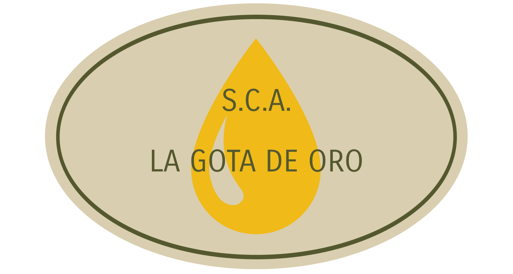

<p align="center">
  
  
</p>

# Web de muestra - Cooperativa "La Gota de Oro"

Este repositorio contiene una web de muestra desarrollada con [Astro](https://astro.build/) para la cooperativa ficticia **"La Gota de Oro"**.

El objetivo de esta web es servir como punto de inicio y presentación para el proyecto de gestión de la almazara de aceituna _OleoControl_. Se trata de una única página sencilla, con una estructura clara, accesible y moderna.

## ✨ Características

- Proyecto basado en Astro.
- Página de muestra con estructura básica (header, main, footer).
- Enlace destacado en el header que lleva a la landing page del frontend de OleoControl.
- Código limpio y fácil de extender.

## 📁 Estructura del Proyecto

```
/
├── public/
│   └── (imágenes o archivos estáticos)
├── src/
│   ├── assets/
│   ├── components/
│   │   ├── Footer
│   │   ├── Header
│   │   ├── Landing
│   │   ├── Main
│   │   ├── MapSection
│   │   └── Section
│   ├── layouts/
│   │   └── Layout.astro
│   └── pages/
│       └── index.astro
├── astro.config.mjs
├── package.json
└── README.md
```

## 🚀 Cómo iniciar el proyecto

1. Clona este repositorio:

```bash
git clone https://github.com/BiLLY-1983/oleocontrol-web.git
cd oleocontrol-web
```

2. Instala las dependencias:

```bash
npm install
```

3. Inicia el servidor de desarrollo:

```bash
npm run dev
```

4. Abre tu navegador en `http://localhost:4321`.

## 🔗 Enlace a la Landing Page del Frontend

Puedes visitar la landing page del frontend del sistema OleoControl desde el menú superior o directamente en:

[OleoControl](https://oleocontrol-front-production.up.railway.app/)

## 📦 Tecnologías utilizadas

- [Astro](https://astro.build/)
- HTML
- Tailwind


## Créditos

Proyecto desarrollado como parte del ciclo formativo de Desarrollo de Aplicaciones Web (DAW).  
---

© 2025 OleoControl. Todos los derechos reservados.

## Autores

Este proyecto fue desarrollado por:

- [@BiLLY-1983](https://www.github.com/BiLLY-1983)


